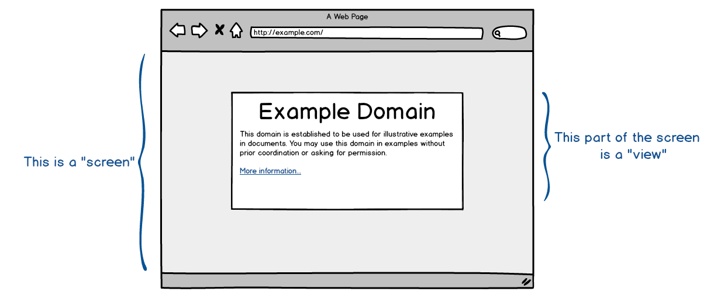

 MVC
=====

 You're doing it wrong
----------------------- 

One of my major gripes with `MVC` and the way it is usually implemented (either by individual coders or by Frameworks) is that what is most often called "MVC" in true fact isn't.

One of the first things I see going wrong is code having Model/View/Controller classes, instead of having Model/View/Controller *layers*.

Another thing that seems to go awry is that the communication between these classes does not adhere to the (original) principle of MVC. 

          ->    Controller (Input)
                   |            \
    User           |           Model (Persistence, Business Logic)
                   |            /
          <-    View (Presentation)

I'm not saying these implementations don't work or don't do a go job, but they are *not* MVC. Odds are there is, in fact, already another name for the architecture behind the implementation.

It could very well be a `Model–view–adapter` or `Model–view–presenter` or `Model-View-ViewModel` or `Presentation–Abstraction–Control` or any other flavour of Three-Tier Architecture. Maybe your controller doesn't actually controll anything an you are merely using an Observer pattern. Who knows? These are all just as useful and valid as MVC but *they are not MVC*.

But what's in a name right?

Seperation of concerns is always good and if your codebase has an architecture that uses _any_ way of separating the presentation from the model and separating the controller from the view then I applaud you. Well done!

But lets not call it MVC, shall we?

 A screen is not a view
------------------------

Another thing that tends to annoy me is that what a lot of people tend to call a 
`view` encompasses a lot more than it should. 

A view is the part that deals with the output of an application. It can be any 
output representation of data. I think thus far everybody can agree on this 
definition. But the devil is in the details. Originally, (to the best of my 
knowledge) the view was ment for a single *part* of data. So an entire webpage 
would have to be build up out of several views. Example:

You can easily see how this goes wrong when an application is not able to return 
only part of any screen (or page) as, for instance, a JSON object instead of 
HTML. 

sources:

 - http://amix.dk/blog/post/19615
 - http://c2.com/cgi/wiki?ModelViewController
 - http://en.wikipedia.org/wiki/Model%E2%80%93view%E2%80%93controller
 - http://heim.ifi.uio.no/trygver/themes/mvc/mvc-index.html
 - http://lorenzo-dee.blogspot.nl/2013/09/model-view-controller-mvc-misunderstood.html
 - http://martinfowler.com/eaaCatalog/serviceLayer.html
 - http://stackoverflow.com/questions/10675512/understanding-mvc

 -- EOF --
